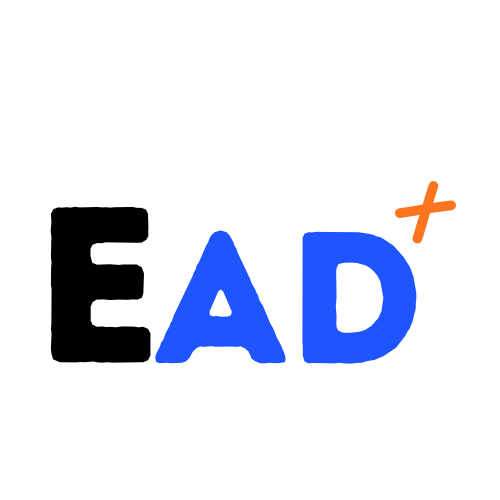
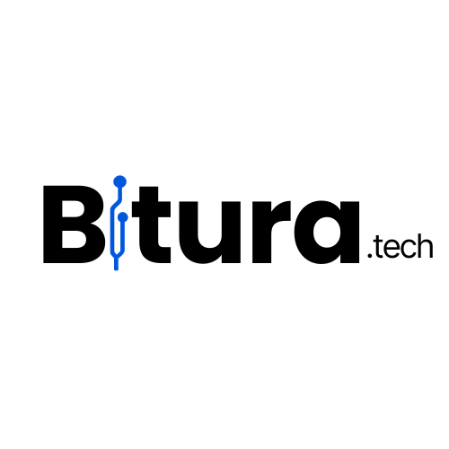

  

---

## Conectando Escola, Alunos e Comunidade

O **EAD+** nasceu da vontade de aproximar a tecnologia do dia a dia escolar.  
Mais do que um sistema de notas ou frequência, queremos **criar um espaço onde alunos, professores e a comunidade possam se comunicar de forma simples, rápida e acessível**.

Nosso propósito é transformar o modo como as informações circulam dentro da escola, facilitando o compartilhamento de avisos, eventos, cardápios, horários e muito mais, tudo em um só lugar.

---

### Por que o EAD+?

Muitas vezes, informações importantes se perdem no caminho: avisos que não chegam, panfletos que desaparecem ou comunicados que demoram.  
O **EAD+** surge como uma **ponte digital** para resolver isso, reunindo tudo o que é essencial em uma plataforma prática e colaborativa.  

Imagina atualizar o cardápio do dia, divulgar o calendário escolar ou avisar sobre uma reunião, tudo de forma direta, sem precisar imprimir ou repassar recados.  
Além disso, abrimos espaço para futuras interações, como **comentários e confirmações**, tornando o sistema ainda mais dinâmico.

---

### Como funciona

O **EAD+** é pensado como um **hub de informações escolares**,  
um ponto de encontro digital entre **alunos, professores, pais e funcionários**.

Ele reúne recursos como:

- **Calendário escolar** com eventos e datas importantes.  
- **Painel de avisos** e comunicados da escola.  
- **Cardápio do dia** de forma prática e visual.  
- **Organização de horários e atividades.**  
- **Possível interação futura** com alunos e responsáveis (comentários, presença no almoço etc).  

Tudo isso de forma leve, acessível e com foco no aprendizado.

---

### Um olhar para o futuro

Nosso projeto não busca burlar regras ou incentivar o uso indevido de celulares,  
mas sim **mostrar que a tecnologia pode ser uma aliada da educação**,  
tornando o cotidiano escolar mais integrado, participativo e conectado com o presente.

Queremos que o **EAD+** cresça junto com as necessidades da escola,  
se tornando uma ferramenta viva, feita para e pelos estudantes.

---

### Sobre o Projeto

Este site foi desenvolvido como parte das disciplinas **Programação Web I e II**  
do **Curso Técnico em Informática Integrado ao Ensino Médio**,  
na **Escola Estadual Professor Antônio Dantas**  

Mais do que um trabalho, o **EAD+** representa uma experiência prática de aprendizado,  
onde aplicamos o que estudamos em **desenvolvimento web, design e inovação**.  

Também é uma iniciativa que fortalece o **time [Bitura.tech](https://beacons.ai/bitura)**,  
um grupo de estudantes que acredita na tecnologia como caminho para criar soluções reais dentro da escola.

---

### Próximos passos

Nosso plano é expandir o **EAD+** para uma plataforma colaborativa completa,  
com recursos interativos e novas formas de integrar toda a comunidade escolar.  

Cada atualização será um passo a mais para **tornar a tecnologia parte natural do ambiente educacional.**

---

  

  <b>Desenvolvido com 💙 por estudantes do Curso Técnico em Informática</b> 
  <b>Escola Estadual Professor Antônio Dantas</b> Apoio: <a href="#">Bitura.tech</a>

